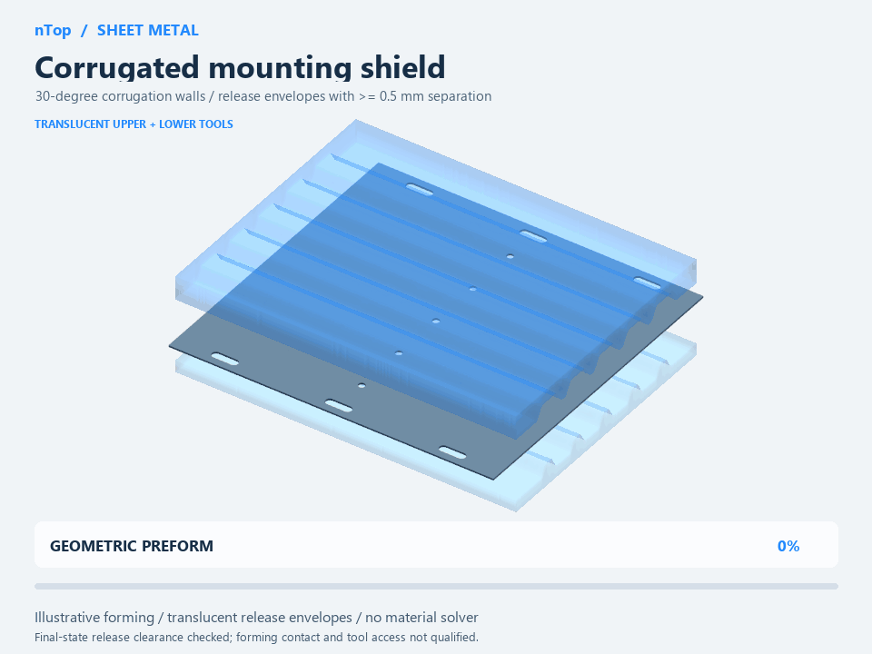
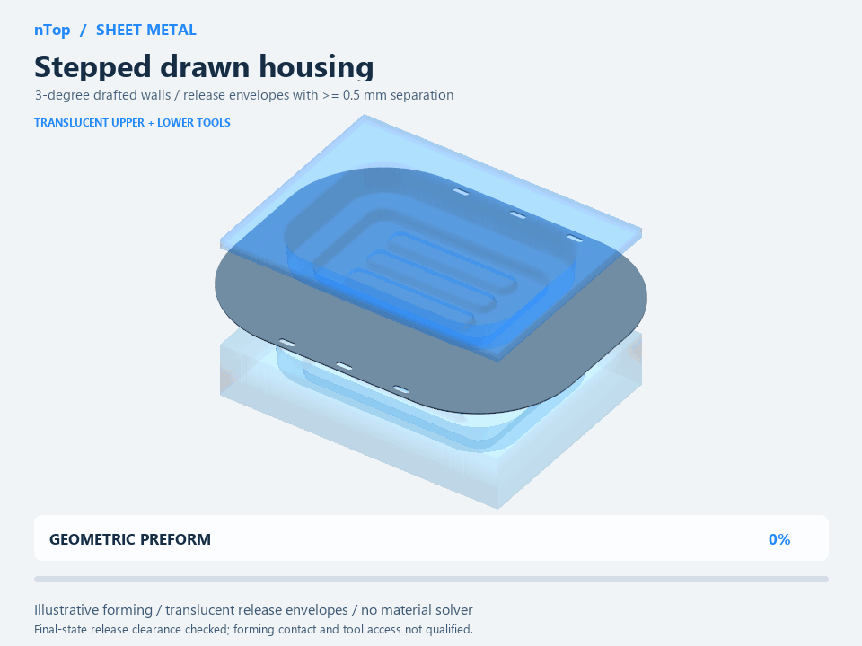
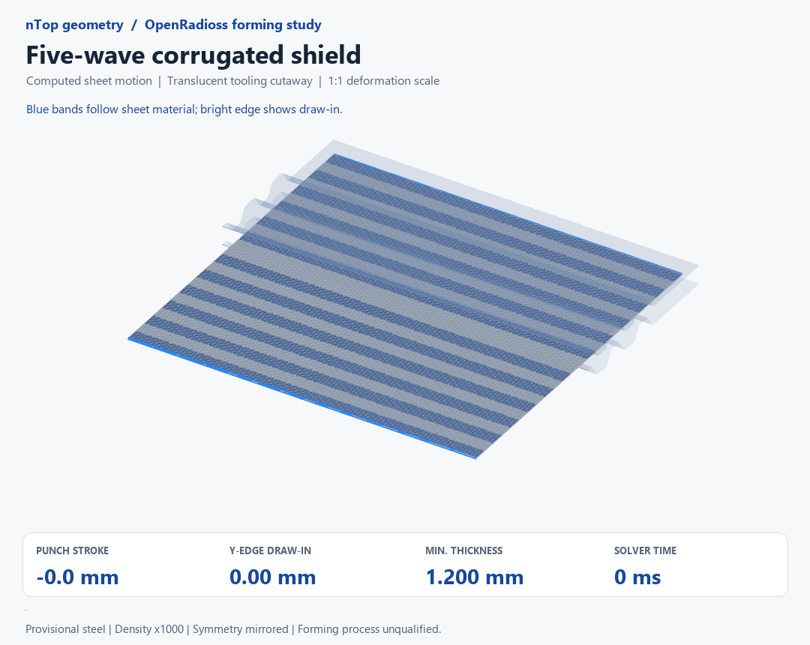

# Sheet metal with implicit geometry: models, tools and forming

Build a reusable sheet-metal geometry workflow in nTop, then distinguish geometric intent from computed forming behavior. This community edition compares implicit and B-rep approaches using three editable notebooks, an offline HTML report, three GIFs, two interactive engineering demos, exact notebook block references, and recorded external OpenRadioss evidence.

**Start here:** download [sheet-metal-workflow.zip](sheet-metal-workflow.zip), extract it, and open `report.html`. Keep its adjacent folders. The report uses nTop blue, works offline and includes play/still controls, charts and sources. GitHub shows HTML source rather than running the report.

**Compatibility:** the native file headers record development version **6.1.0**. The catalog's 6.1+ value reflects this header; public-build compatibility is unverified. No prerelease executable is included. The HTML demos do not require nTop.

## Why this workflow

Implicit geometry is useful for repeated profiles, spatially varying features, Boolean combinations and generating related geometry from shared definitions. Conventional B-rep sheet-metal CAD remains a strong choice for bend tables, standard flat patterns, drawings and familiar downstream CAD/CAM exchange. Both can be parametric and automated; this study is not a timed performance comparison.

## Example GIFs

### Target geometry and translucent tools — prescribed motion

The sheet follows an authored mapping. This is a geometry/release-envelope illustration, not material-flow simulation or qualified die design.

The housing has provisional 3-degree draft. Constant target thickness and visually separated tools do not establish a feasible draw or production clearance.

### Actual external FE motion — diagnostic result

The sheet moves from computed nodal coordinates. Corrugated-r5 has 13.99 mm mean Y-edge draw-in and 17.62% maximum computed thinning. Material strain coverage and mesh/density sensitivity remain unresolved, so these are diagnostic values.

## Installation and use

1. Extract the download and open `report.html` in a modern browser.
2. Read [notebook-walkthrough.md](notebook-walkthrough.md), then open a copy of one of the `.ntop` files in `models/` in a compatible nTop build.
3. Expand Inputs, Calculations, Construction and Checks. The walkthrough gives exact saved block labels; Expressions contains generated intermediate arithmetic.
4. Use the browser bend/K-factor and draft/release demos to understand the relationships. They are analytic illustrations, not nTop execution or FE predictions.
5. Inspect `recipes/` and `evidence/` for graph definitions, hashes, mesh checks and numerical results. Changing a notebook invalidates the recorded baseline comparison until reevaluated.

| Demo | Key inputs | Saved outputs / scope |
|---|---|---|
| Enclosure | Thickness, Inside bend radius, K factor, envelope, seam gap, root radius | `Formed enclosure`, `Flat enclosure blank`; beveled miter edges need preparation |
| Corrugated shield | Thickness, Inside bend radius, tangent lengths, length, holes | `Final Corrugated mounting shield`; five waves with analytic bends |
| Stepped housing | Thickness, step rises, floor radius, bead dimensions | `Final Stepped drawn housing`; 3-degree draft is a compiled meridian choice |
| External FE evidence | Recorded material, contact, mesh and release setup | Draw-in, thinning and elastoplastic unloading diagnostics; not an nTop solid or production qualification |

## Important results and limits

Three forming cases and three settled unloading cases are summarized in the report. Crossmember inertia and housing contact checks fail; all forming cases exceed the source hardening-table strain range. All unloading cases pass the selected settling screens but show additional plastic strain, so this package does not claim elastic-only springback, certified blanks or compensated production dies. Only three of the six complex geometry families were simulated.

These are previously recorded runs, not new simulations for this publication. The archive does not contain the full FE solver environment. Public manufacturer families inspired the original study geometry; no supplier CAD or source photographs are redistributed. See [source ledger](evidence/source-ledger.json), the report's primary references, and [notebook index](evidence/notebook-index.json).

The enclosure corner image was regenerated without desktop automation: nTop Automate exported a local mesh at a 0.01 mm setting, then PyVista/VTK rendered it offscreen. The source notebook is unchanged. This is a render of native exported geometry, not an nTop viewport screenshot; [capture provenance](evidence/corner-render.json) records its hashes and settings.

## License

MIT for the original study files, report, figures and code in this package; see [license.txt](license.txt). Linked third-party documentation and the nTop/OpenRadioss applications retain their own licenses. No supplier endorsement or manufacturing release is implied.
