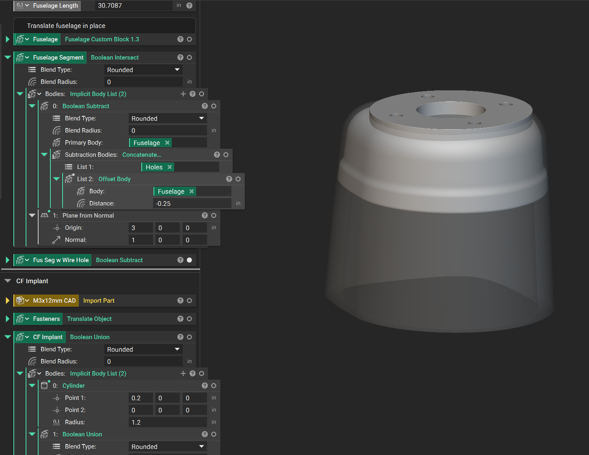
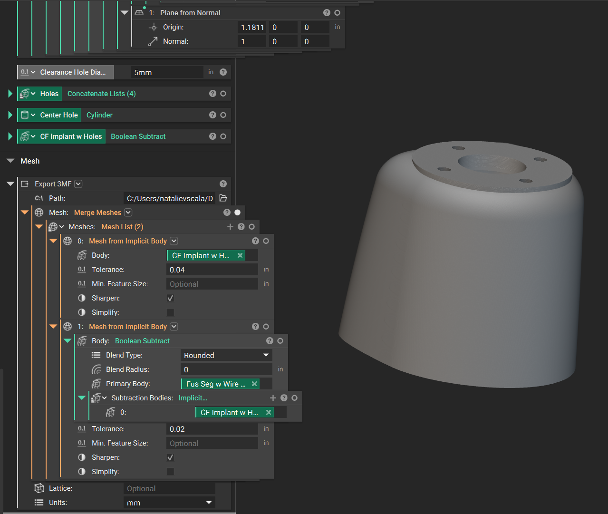
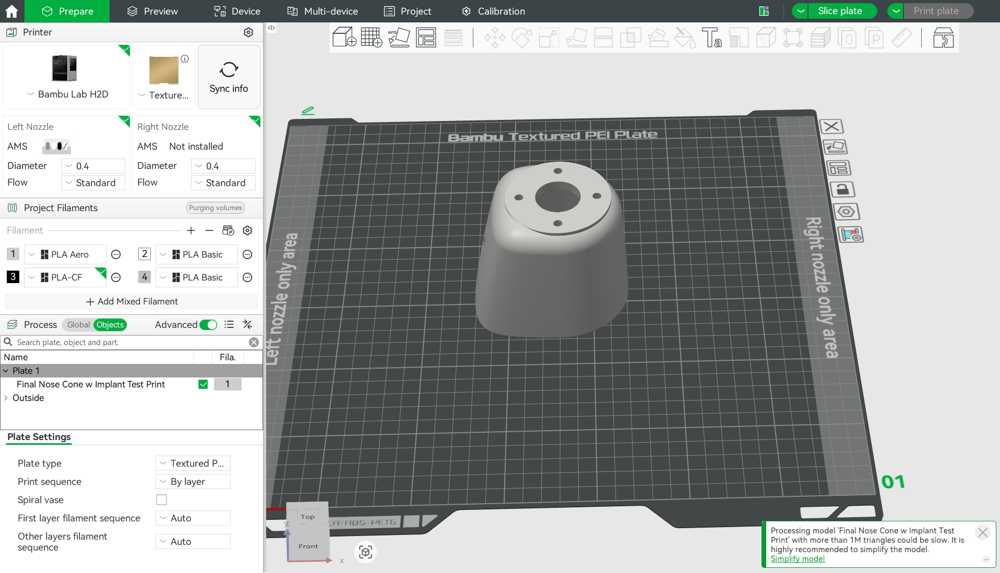
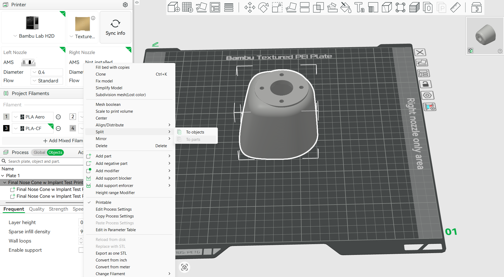
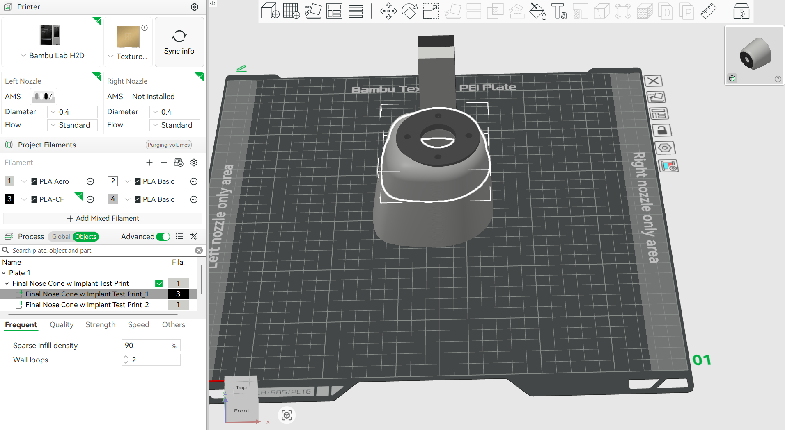

# Exporting an nTop File for Multi-Material Printing

Export multi-body nTop designs for multi-material FDM printing. The included nTop file of a PLA aero nosecone with a PLA-CF motor mount implant serves as a worked example throughout.

## Step 1: Define and Separate Your Material Zones

Before exporting, make sure your design is explicitly split into distinct bodies within nTop. Each material or color zone must be its own independent **CAD Body** or **Mesh**.

**Note:** Avoid overlapping geometry. Use **Boolean Subtract** or **Boolean Intersect** to ensure that where Material A ends, Material B begins with a clean interface.

Start with your multiple implicit bodies positioned and dimensioned as desired.

Note that the matrix body "Fus Segment w Wire Hole" is meshed with a cutout of the "CF Implant" through a Boolean Subtract to ensure a clean interface. Mesh each object and **Merge Meshes** to export to your slicer.

Merging within nTop protects the relative positions of bodies by preventing the slicer from snapping objects back to the print plate — this allows objects to remain suspended within your structure. You can then split them by part in the slicer to specify varying filament types.

> Do not export the bodies as one single mesh. Your slicer will read it as one body and you will be unable to split the file by part.

## Step 2: Choosing the Right Export Format

- **3MF (Highly Recommended)**
  - **Why:** 3MF files natively support multi-body assemblies, color data, and relative spatial positioning.
  - **How:** Use the **Export Mesh** block and select `.3mf`. Most modern slicers (Bambu Studio, Cura) will instantly recognize it as a multi-material object.

- **STEP (For CAD/NURBS workflows)**
  - **Why:** Best if sending to a high-end toolpath generator or if you need precise analytical geometry.
  - **How:** Convert your implicit bodies to CAD faces using **CAD Body from Implicit** and use the **Export CAD** block.

- **Separate STLs (The Legacy Way)**
  - **Why:** Use this only if your slicer doesn't support 3MF.
  - **How:** Export each material zone as an individual `.stl` file.

## Step 3: Slicer Import Best Practices

The most important part of multi-material printing is maintaining the shared coordinate system so parts align automatically. The easiest method is to export a 3MF of merged meshes. Example shown in Bambu Studio:

Import your part into your slicer.

Right-click your project in the "Objects" tab, go to "Split", and select "To Parts".

Select the filament type for each object by clicking the numbered/colored box next to the object name.

**Alternative methods:**

- **If using 3MF:** Drag and drop the file into your slicer. If prompted to "Load as a single part with multiple bodies," click **Yes**. Right-click each sub-body to assign it to a specific extruder/filament.
- **If using STLs:** Select *all* exported STL files at once and drag them into the slicer together. Say **Yes** when asked to treat them as a single object with multiple parts — otherwise the slicer drops them all onto the build plate separately, destroying alignment.

## Final Notes

**Mesh Density:** Multi-material boundaries need to line up exactly. If mesh resolution is too low on one body, you may get tiny gaps or overlaps at the interface. Keep **edge length** consistent across all bodies during the meshing phase.

**Voids:** If one material is entirely embedded inside another, make sure you have physically hollowed out the matrix material. Slicers don't always handle overlapping volumes well.

**Elevation:** If one object is embedded within another and intended to print at some elevation above the print bed, **Merge Meshes** in nTop and export the merged 3MF. You can then split the objects in the slicer to specify filament type.

**Mesh Tolerancing:** Set your mesh tolerance to about a third of your printer's smallest feature size. If you're not happy with how the mesh represents your smallest features, increase your tolerance or input a **Min. Feature Size**.

Find a balance between accuracy and file size — cutting tolerance in half quadruples the triangle count, which can create massive files that freeze your slicer. 3D printers also have a physical resolution limit, so setting tolerance smaller than the machine's capabilities wastes computing power.

## Example Files

| File | Description |
|------|-------------|
| `Final Nose Cone w Implant Test Print.ntop` | PLA nosecone with PLA-CF motor mount implant — multi-material workflow example |
| `Final Nose Cone w Implant Test Print.3mf` | Exported 3MF ready for slicing |

## License

MIT.
